```{r setup, include=FALSE}
knitr::opts_chunk$set(echo = TRUE)
```


## Research Question: Predictive

Can economic and demographic indicators be used as a predictor of Olympic medal counts across countries in the Summer and Winter Olympics?

### Why does this matter?

We chose this topic out of genuine curiosity. We both bring international perspectives, and the 2026 Winter Olympics in Italy got us wondering why some countries consistently win more medals than others. That led us to ask whether economic and demographic indicators can help predict a country's medal count in the Summer and Winter Olympics. While the project is driven by our own interest in the question, we can also imagine practical uses, for example, a model that predicts medals from structural country characteristics could give sports ministries or National Olympic Committees a benchmark for comparing their own performance against structurally similar countries.


### Why is predictive analysis the best for this project?

Our goal for this project is to explore how a country's economic and demographic indicators are related to a country's Olympic performance in medal count. Predictive analysis is the best fit for this goal because it leverages historical data, statistical learning, and machine learning to estimate Olympic medal outcomes using historical data.

## Data Sources

### Olympic Medal Data and World Bank Indicators

Our project relies on two main data sources. The first is Olympic medal data from the Summer and Winter Games, which we web scraped from Wikipedia medal tables. The second is economic and demographic data from the World Bank Open Data platform, from which we collected a wide range of country-level indicators related to economic development.

The Olympic dataset provides information on medal counts by country, year, and season, while the World Bank dataset adds economic and social context for each country-year observation. Combining these two sources allowed us to study how national characteristics may relate to Olympic performance.

### Key variables of interest from Olympics Medal Data

| Variable | Name | Description |
|--|--|----|
| Country | `country` | Country competing in the Olympics |
| Gold Medals | `gold` | Total number of gold medals won by a country |
| Silver Medals | `silver` | Total number of silver medals won by a country |
| Bronze Medals | `bronze` | Total number of bronze medals won by a country |
| Total Medals | `total` | Total number of medals won by a country |
| Year | `year` | Year the Olympics Games were held |
| Season | `season` | Summer or Winter Olympics |

### Key variables of interest from World Bank Indicators

| Variable | Name | Description |
|--|--|----|
| GDP Per Capita | `gdp_per_capita_ppp` | GDP per capita of a country measured in current USD |
| Total Population | `population_total` | Total population of a country |
| Education Spending | `education_spending` | Education spending of a country measures in Percentage of GDP, National currency, Percentage of expenditure |
| Life Expectancy | `life_expectancy` | Average life expectancy of a country measures in years |

*Note: The World Bank Indicators dataset includes 70 variables, excluding excluding country and year as the ID variables*

## Predictive Analysis

### Data Wrangling and Preparation

#### Building the Main Dataset

After collecting the Olympic medal data from Wikipedia and the economic indicators from the World Bank API, we cleaned and combined both sources into one main dataset.

For the Olympic data, we scraped the Wikipedia category pages for both Summer and Winter Olympic medal tables, extracted the yearly page links, and looped through each page to identify the correct medal table. Since the medal table was not always located in the same position on each page, we identified it by checking for key columns such as rank, gold, silver, bronze, and total. We then cleaned country names, removed unnecessary rows such as totals and mixed teams, and added the corresponding year and season.

For the World Bank data, we downloaded multiple economic and demographic indicators from the World Bank's publicly-available API by country and year, then combined them into one wide dataset. Since there are many indicators, we made a list of potentially relevant indicators to have many variables to select from for our prediction We then left-joined the World Bank data with the Olympic medal data by country and year so that each Olympic observation could be matched with the available country-level indicators.

#### Exploring the Variables

Once the datasets were merged, we explored the raw variables to better understand their distributions. These initial plots showed that several variables, especially GDP and population, were strongly right-skewed. Because of this, we applied log transformations to improve the distributions and make the visualizations easier to interpret.
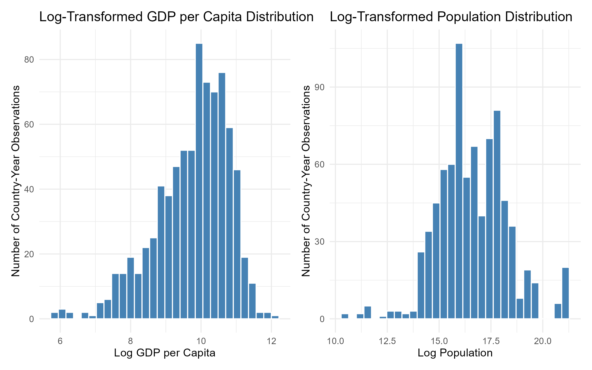

Medal-related variables, however, remained somewhat skewed even after transformation, so we decided not to apply the log transformation for the data visualizations. This is expected, since many countries win very few medals while a small number of countries win many.
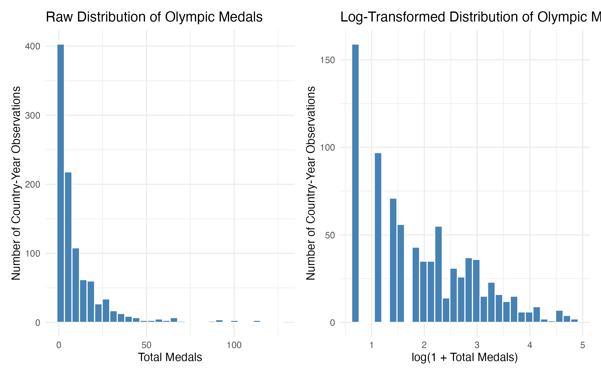

Education spending did not appear to be very skewed and life expectancy appeared to be left-skewed, so we decided to keep these variables as they are without a log transformation.
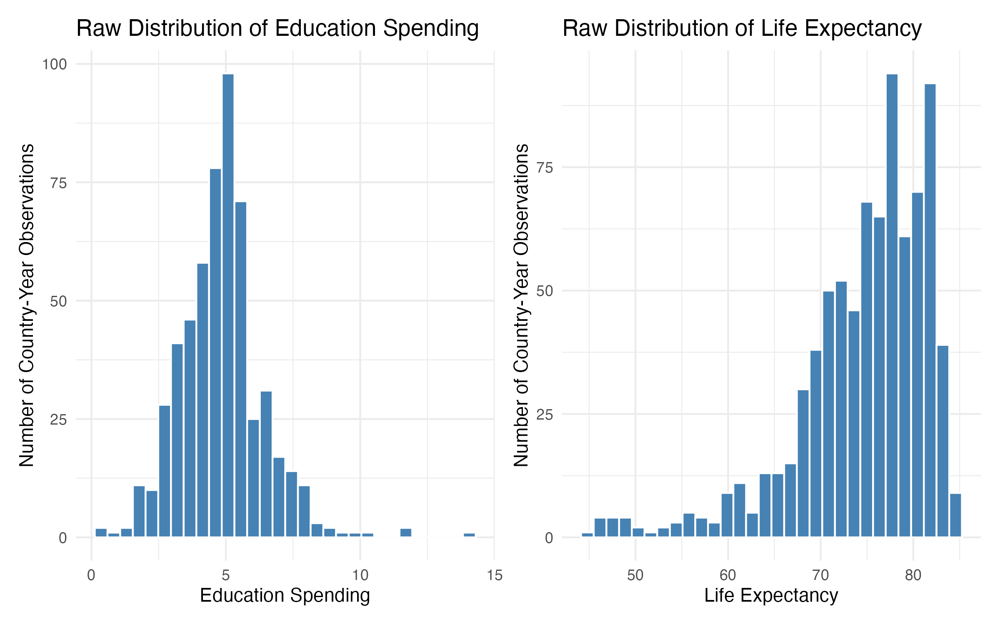

Due to the scope of this stage, we decided to start our focus on these four predictor variables (GDP per capita, population, education spending, and life expectancy) to thoughtfully explore the data and the relationships between these variables and medals.

#### Selecting the Most Complete Time Period

Because the World Bank data were incomplete for some countries and earlier years, we also conducted a completeness check by year. We measured the amount of non-missing data available across indicators and identified the period with the strongest overall coverage.

This step allowed us to focus the analysis on the years with the most complete information, creating a cleaner and more reliable dataset for visualization.

### Exploring the Data with Figures

#### Global Distribution of Olympic Medal Totals

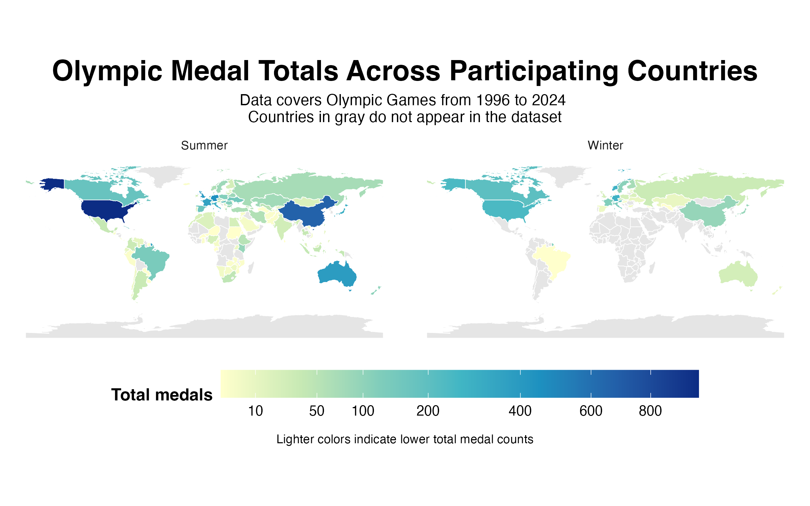
This figure uses a choropleth map to show Olympic medal totals by country for the Summer and Winter Olympics. A map was chosen because the goal is to show geographic patterns in medal distribution across the world, and faceting by season allows an easy comparison between Summer and Winter Games. Color intensity represents total medals, with darker colors indicating higher totals. Because medal totals are highly skewed, a square-root transformation was applied to the color scale so that differences among countries with smaller medal totals are still visible. Gray countries are countries that do not appear in the medal dataset.

#### Relationship Between Economic Development and Olympic Success

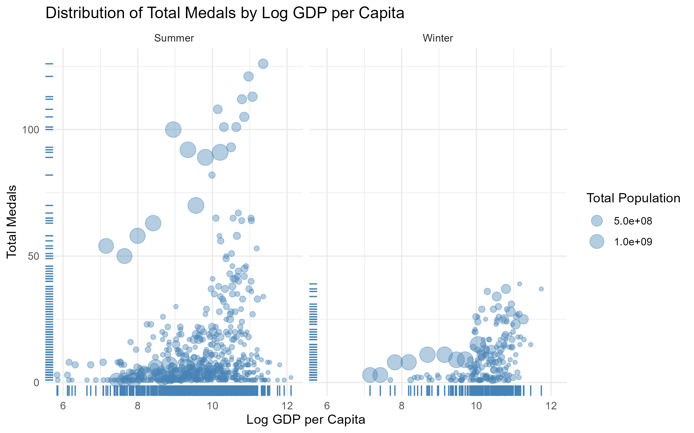
This figure uses a scatter plot with marginal rug plots to examine the relationship between economic development (measured by log GDP per capita) and Olympic success (measured by total medals), with point size representing population. A scatter plot is used because it allows visualization of the association between two continuous variables while also capturing variation across countries and Olympic seasons. Rug plots along the axes provide additional detail on the distribution of observations for both log GDP per capita and total medal counts. Point size is scaled by population to account for differences in country size, which may influence both economic output and Olympic performance. Faceting by season separates Summer and Winter Olympics, allowing for comparison of whether the GDP–medal relationship differs across Olympic contexts.

#### Economic Development and Medal Type Distribution

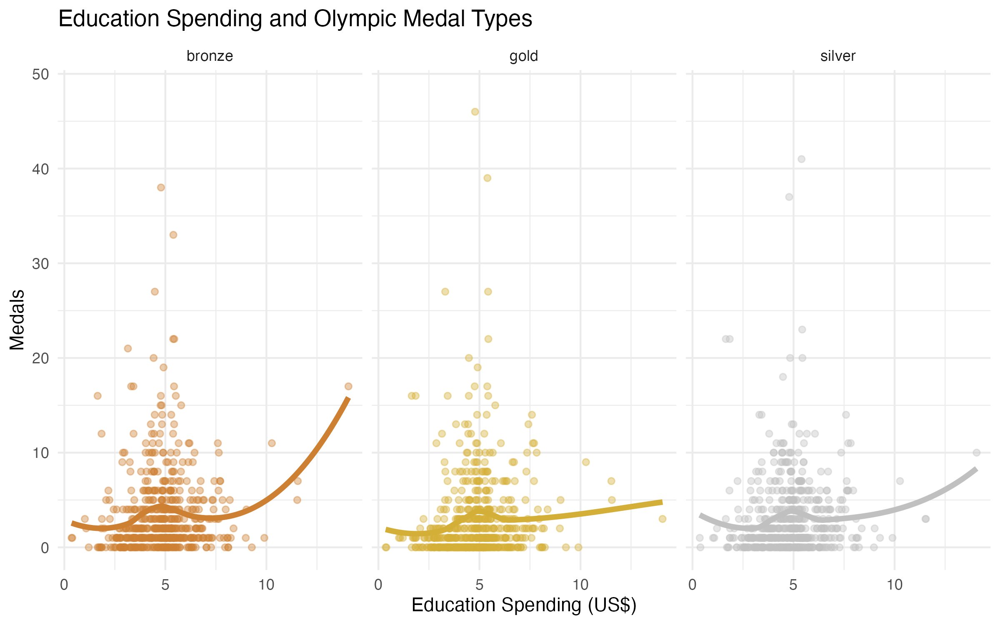
This figure uses a scatter plot with smoothed trend lines to show the relationship between education spending and Olympic medal outcomes by medal type (gold, silver, and bronze). A scatter plot is chosen because it allows visualization of the distribution of country-year observations and the underlying variation in medal counts across different levels of education spending. A LOESS smoothing line is added to highlight the nonlinear relationship between education spending and medal performance without imposing a strict functional form. Faceting by medal type allows for clear comparison of how education spending relates differently to gold, silver, and bronze medal outcomes. Color distinguishes medal types using the standard Olympic color scheme, and the smoothing trends help reveal whether higher education investment is associated with systematically higher medal counts across different medal categories.

#### Medal Composition in High Life Expectancy Countries

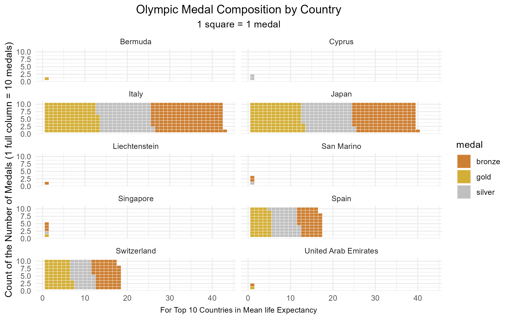
This figure uses a waffle chart to show the composition of Olympic medals (gold, silver, and bronze) for the 10 countries with the highest average life expectancy. A waffle chart is chosen because it provides an intuitive, discrete visualization of categorical parts of a whole, where each square represents one medal and allows direct visual comparison of both total medal counts and medal composition across countries. Faceting by country enables easy comparison of how medal distributions differ across nations with similar levels of life expectancy. Color distinguishes medal types, with gold, silver, and bronze mapped to their standard Olympic color scheme. The figure highlights whether countries with higher life expectancy tend to have not only higher total medal counts but also different compositions of medal types.

## Building the Machine Learning Model

### Methods

#### Target variable

We predict the total number of Olympic medals won by a country in a given Games. Because raw medal counts are heavily right-skewed, most countries win few or no medals while a small number of large economies win many, we transform the target using `log(1 + total_medals)`. The `log1p` form handles the many zero counts without dropping them, and it stabilizes the variance so that the models are not dominated by high-performing countries. All reported model predictions are back-transformed with `expm1()` when we need to interpret them on the original medal scale.

#### Predictor set

Starting from the merged Olympic–World Bank dataset, we removed any variable with more than 50% missing values, variables that would leak the outcome (`gold`, `silver`, `bronze`), and the raw `total_medals` column once the log target was created. We kept `season` (Summer/Winter) as a predictor because the two Games reward different sports and country strengths. `country` and `year` are retained in the data frame so they can be used as a grouping variable for cross-validation, but they are marked as an ID column in the recipe so they do not enter the model as a predictor.

#### Preprocessing recipe

All preprocessing is done in the `tidymodels` recipe so that every step is refit inside each cross-validation fold, preventing information leakage from validation rows into training rows. The steps are: median imputation for numeric predictors, modal imputation for nominal predictors, dummy encoding of nominal predictors, zero-variance filtering, and standardization of numeric predictors. Standardization is harmless for Random Forest but important for Lasso, so we apply it uniformly.

#### Train/test split and cross-validation

Our data is a country-year panel, so a random row-level split would place the same country on both sides of the split. This would allow the model to memorize country-specific effects and prevent its ability to generalize. We instead use a group-based 80/20 split (with `group = country`), so every country falls entirely in training or testing. Within the training set we use 5-fold cross-validation, also grouped by country. Hyperparameters are tuned on those grouped folds. This setup asks the question: "How well does this model predict medals for countries it has never seen?"

#### Models compared

We compare three models of increasing flexibility against a simple baseline:

- **Baseline:** Predict the training-set mean of `log(1 + total_medals)`. This tells us whether the ML models beat the baseline forecast with no information or historical data.
- **Linear Regression:** Standard OLS with the full preprocessed predictor matrix. No hyperparameters to tune.
- **Lasso Regression:** Linear model with an L1 penalty that shrinks coefficients toward zero, tuned over a 30-point grid for `penalty`. Lasso is useful here because many of our 60+ World Bank indicators are highly correlated.
- **Random Forest:** A non-parametric ensemble of regression trees that captures non-linearities and interactions automatically. We tune `mtry` (predictors considered at each split) and `min_n` (minimum node size) over a 20-point grid, with 500 trees.

**Challenge for this project:** Random Forest is our challenge model, since it was not covered in class, and we had to learn a new workflow for model specification, tuning, and interpretation to use `tidymodels` and `ranger`.

### Results

#### Cross-validation performance

The table below shows CV RMSE on the log scale for each model. Lower is better. Because CV is grouped by country, these values reflect generalization to held-out countries rather than to held-out years of familiar countries.

```{r, echo=FALSE, message=FALSE, warning=FALSE}
library(readr)
library(dplyr)
library(knitr)

kable(read_csv("../output/tables/cv_model_comparison_wide.csv", show_col_types = FALSE),
  digits = 3,
  col.names = c("Model", "RMSE", "MAE", "RSQ"),
  caption = "Cross-Validation Model Comparison"
)
```
*Note:* Random Forest achieved the lowest grouped CV RMSE of 0.798, outperforming Lasso (0.861), Linear Regression (0.956), and the mean baseline (0.990). This is telling us that each model is improving upon the baseline since the RMSE is decreasing and that the Random Forest is the best performing model by these metrics, with the smallest MAE of 0.636 and the largest R² of 0.373.

#### Test-set performance

After selecting the best model by CV RMSE and refitting on the full training set, we evaluated once on the held-out test countries.

```{r, echo=FALSE, message=FALSE, warning=FALSE}
kable(read_csv("../output/tables/test_set_metrics.csv", col_names = TRUE),
      digits = 3,
      col.names = c("Model", "Metric", "Estimate"))
```
*Note:* Comparing the RMSE from CV and the test, we see that the test RMSE is is larger but only by 0.38, indicating stable generalization of the model. Furthermore, the test MAE is larger but only by a small gap of 0.57, and the test R² is slightly larger as well, explaining 2.6% more of the test data than the model for the CV data.

### Predicted vs. Actual

The figures below plot test-set predictions against actual values for each of the three models. Each pair shows the same data twice: on the original medal-count scale (left) and on the log scale used during model training (right). Points along the dashed 45° line indicate accurate predictions; points above the line indicate that actual medal counts were higher than the model predicted (under-predicted), and points below the line indicate the opposite (over-predicted).

#### Linear Regression 

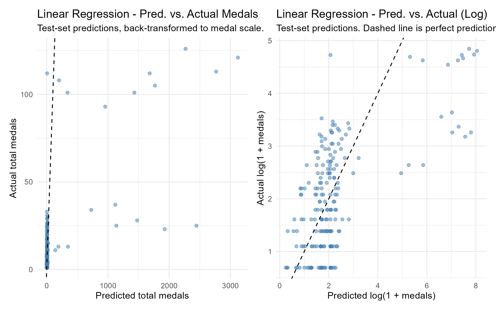
Linear Regression produces a much narrower spread of predictions, clustered in a tight band around the training-set mean. The model rarely predicts very low or very high medal counts, which is why its CV RMSE is only marginally better than the baseline. **The under-prediction of high-medal countries is even more severe than for Random Forest (displayed below Lasso Regression).**

#### Lasso Regression

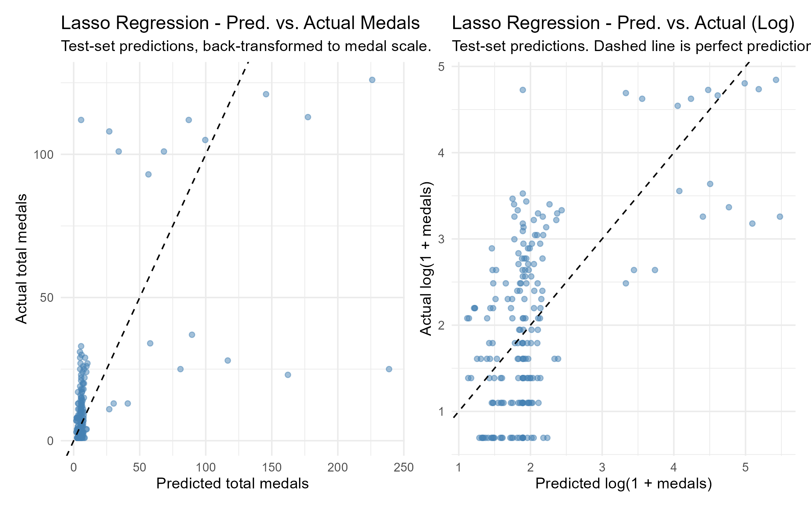
Lasso falls between the two: its predictions span a wider range than Linear Regression but **still narrower than Random Forest**. The improvement over Linear Regression comes from dropping correlated and uninformative predictors, which stabilizes the remaining coefficients. However, this model still lacks capturing non-linearity and interactions.

#### Random Forest

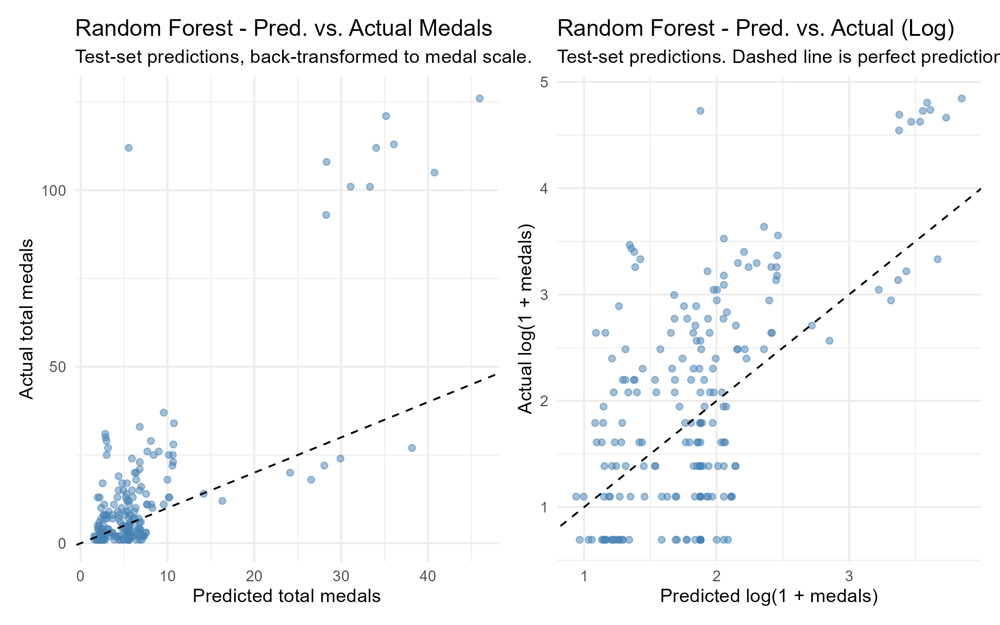
Random Forest spreads predictions over the widest range of the three models, **from roughly 1 to 45 medals**, but still systematically under-predicts the highest-medal countries; actual medal counts of 100+ are predicted at 25–45. This compression at the top is expected for any model trained on a long-tailed target with grouped CV: the held-out test countries include cases that are structurally unlike anything in the training set.

### Interpretations

#### Basline (training mean) 

The baseline model predicts the same average medal outcome for every country, regardless of its economic or demographic characteristics. It serves as a benchmark for evaluating whether more advanced models are learning meaningful patterns from the data. Its relatively high RMSE shows that countries differ substantially in medal performance, and that using no predictors misses important information. It tends to over-predict low-performing nations and under-predict top-performing nations.

#### Linear Regression

Linear Regression assumes that each predictor has a constant additive relationship with medal counts. Its main advantage is interpretability, since coefficients directly show the direction and size of each variable’s estimated effect. For example, for every increase in one unit of a certain predictor, the total predicted medals increases by *X*. However, its performance was only slightly better than the baseline, suggesting that Olympic success is not explained well a linear relationship This model also struggles with multicollinearity among economic indicators, since we have highly correlated predictors in our data that can make coefficient estimates unstable. As a result, it under-predicts countries at the top of the medal distribution and compresses predictions toward the mean.

#### Lasso Regression 

Lasso Regression improves on ordinary Linear Regression by adding an L1 penalty that shrinks less useful coefficients toward zero. This helps reduce overfitting and automatically selects a smaller set of informative predictors from the many correlated indicators. Its smaller RMSE suggests that controlling multicollinearity was important in this dataset. Lasso retained variables such as GDP, age structure, and health expenditure while removing many redundant predictors. However, because it is still a linear model, it cannot fully capture nonlinear relationships or interactions between predictors, which limited its performance compared with Random Forest.

#### Random Forest 

Random Forest (with 500 trees) is the best-performing model, with a CV RMSE of 0.798, CV R² of 0.373, and test-set RMSE of 0.836. Random Forest has about a 3% lower CV RMSE than Lasso Regression, and there are two explanations for this improved test metric. 

- First, RF can use multiple correlated predictors simultaneously: its variable importance plot puts `gdp_constant_usd`, `population_total`, and `gdp_ppp` all in the top four, whereas Lasso had to drop the latter two. 

- Second, RF captures non-linearities and interactions automatically, which matters because the relationship between economic size and medal counts is concave (extra GDP buys more medals at the bottom of the distribution than at the top). 

The fact that the improvement over Lasso is only 3% tells us that once multicollinearity is properly handled by regularization, most of the systematic signal in our predictors is roughly linear, and the additional flexibility of a tree ensemble adds only a little.

### What drives the predictions

#### Random Forest

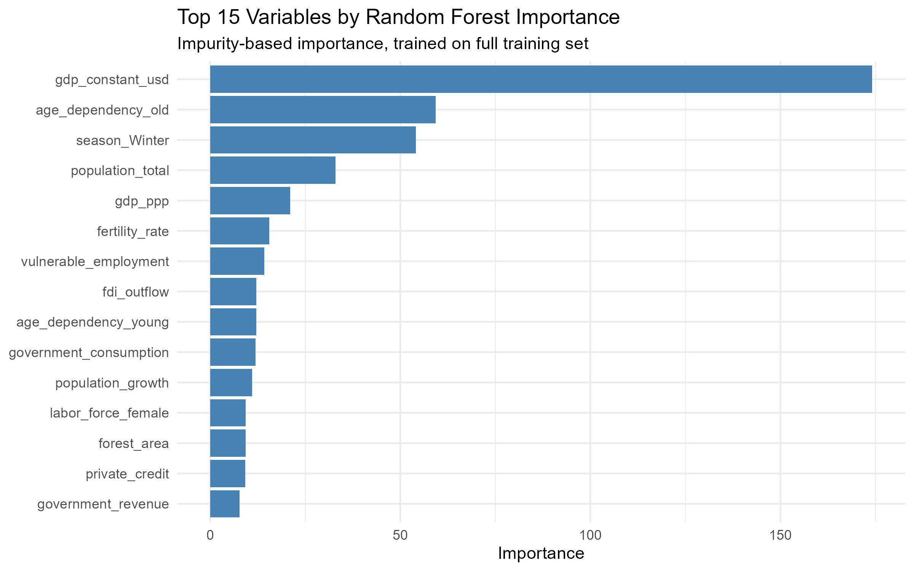
The Random Forest importance plot highlights the predictors that contribute most to reducing node impurity across the 500 trees. This is a measure of predictive usefulness; it is not a causal claim.

#### Lasso Regression

```{r, echo=FALSE, message=FALSE, warning=FALSE}
read_csv("../output/tables/lasso_nonzero_coefficients.csv", show_col_types = FALSE) |>
  select(term, estimate) |>
  arrange(desc(abs(estimate))) |>
  kable(digits = 3,
        col.names = c("Predictor", "Standardized Coefficient"),
        caption = "Non-zero coefficients from the best Lasso model")
```
For an interpretable comparison, we also inspected the non-zero coefficients of the best Lasso model. Predictors with large positive coefficients increase predicted `log(1 + medals)` all else equal; predictors that shrunk exactly to zero were judged unnecessary given the other predictors in the model.

### Limitations

Our group-based cross-validation is a deliberately tough test as the model predicts the performance of a country it never saw during training. A randomly split CV would report better numbers, but would overstate real generalization.

Several important drivers of Olympic success are not captured in our predictor set. We do not include a host-country flag (host nations historically win more medals), prior-Olympics lagged performance, sport-specific federation funding, or geographic or climate variables. Adding these would likely improve performance and would be a natural extension of our project.

Missing values are median-imputed inside the pipeline. This is simple and avoids leakage, but it understates uncertainty for countries with poor World Bank coverage. A more rigorous approach would propagate imputation uncertainty or use multiple imputation.

Wikipedia medal tables occasionally disagree with official IOC records for special cases (mixed teams, reallocated medals after doping decisions, and country-name changes). We normalized a handful of these by hand in Stage 2 but did not exhaustively audit them.

Finally, the target is log-transformed because of right skew, which means large absolute prediction errors in medal counts translate to smaller errors in log space. The model therefore implicitly prioritizes proportional accuracy. Users who care specifically about absolute medal counts for high-performing countries should inspect the back-transformed plot.

### Challenge

Our challenge was to train and tune*machine learning models that go beyond the linear and lasso regression tools covered in class, using the `tidymodels` framework. Specifically, we built a Random Forest regression model with `ranger`, tuned `mtry` and `min_n` via grouped 5-fold cross-validation, compared it against Linear and Lasso baselines using a shared preprocessing recipe, and extracted variable importances for interpretation.

Learning `tidymodels` required us to understand several new concepts: recipes and the role of each step, workflows that bundle models and preprocessing, the separation of `fit_resamples` for plain models from `tune_grid` for models with hyperparameters, and the `last_fit` idiom that guarantees we only touch the test set once. Grouped cross-validation (`group_vfold_cv`) was particularly important: it is the right tool for a country-year panel, and using it made a visible difference in our reported performance compared to naive random CV.

### Conclusion

We trained and compared three supervised regression models to predict the log of Olympic medal counts from a broad set of World Bank indicators, using a grouped train-test split and grouped cross-validation to measure generalization to new countries. Random Forest achieved the best performance, with a CV RMSE of 0.798 and a test-set RMSE of 0.836 (R² = 0.397), beating the mean-prediction baseline by roughly 16%. Lasso came close behind at 0.861, while plain Linear Regression barely improved on the baseline at 0.956. The most important predictors were country-level economic size (`gdp_constant_usd`, `population_total`, `gdp_ppp`) and demographic structure (`age_dependency_old`, `fertility_rate`), broadly consistent with the descriptive patterns we observed in Stage 2: larger and more developed economies tend to win more medals. 

Two findings stood out as analytically interesting beyond the headline ranking. 

- First, the largest performance jump came from the adjustment of out model from Linear to Lasso rather than from Lasso to Random Forest, suggesting that handling multicollinearity in our predictor set mattered more than capturing non-linearity. 

- Second, the test-set RMSE is only modestly larger than the CV RMSE, meaning the model generalizes stably to entirely held-out countries.

## References

https://en.wikipedia.org/wiki/Category:Summer_Olympics_medal_tables

https://en.wikipedia.org/wiki/Category:Winter_Olympics_medal_tables

https://data.worldbank.org/

ChatGPT, 13 Feb. version, OpenAI, 16 Feb. 2023, chat.openai.com.
